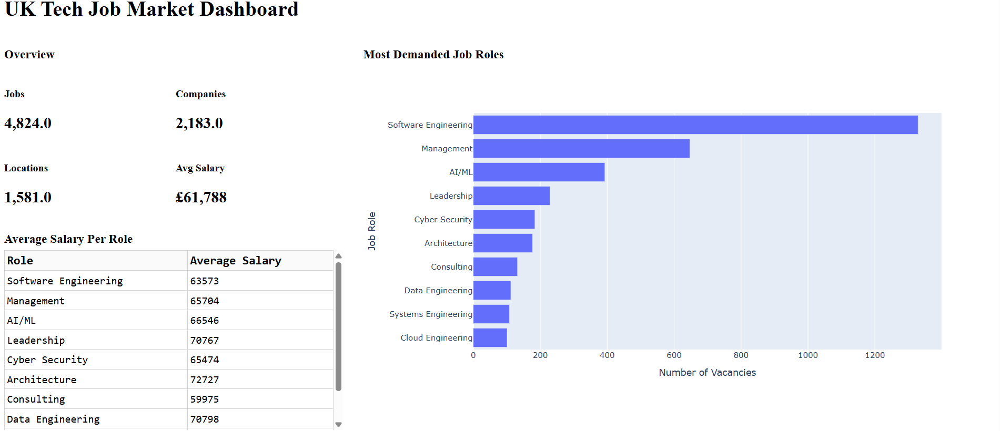
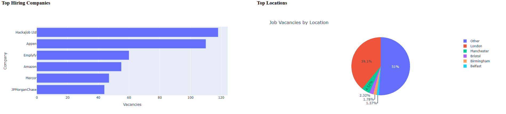
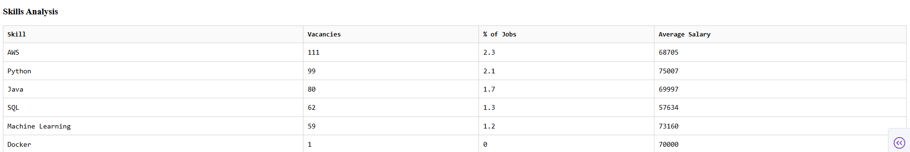
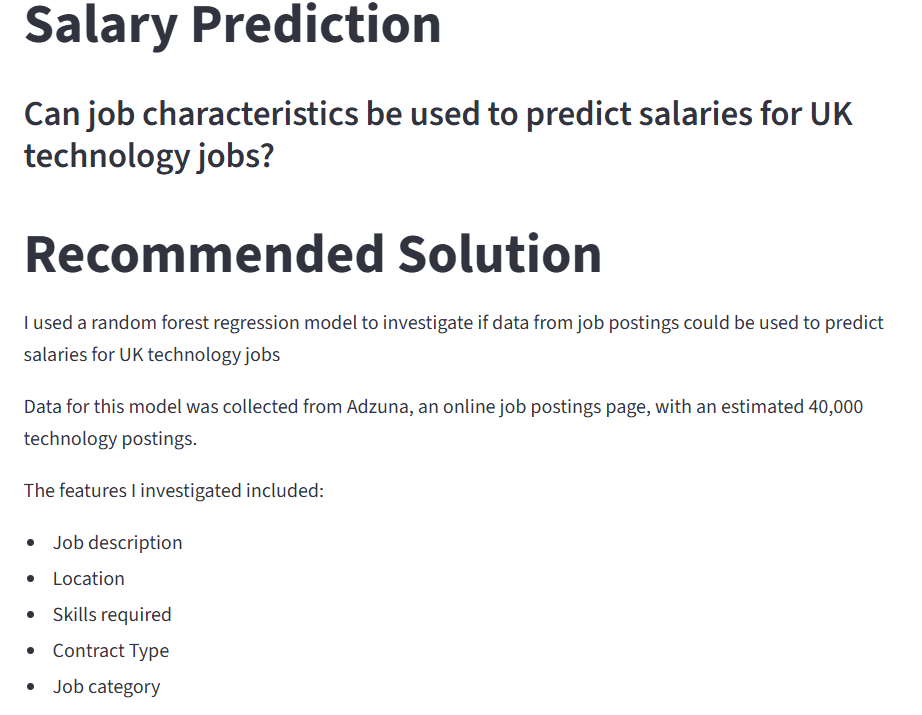
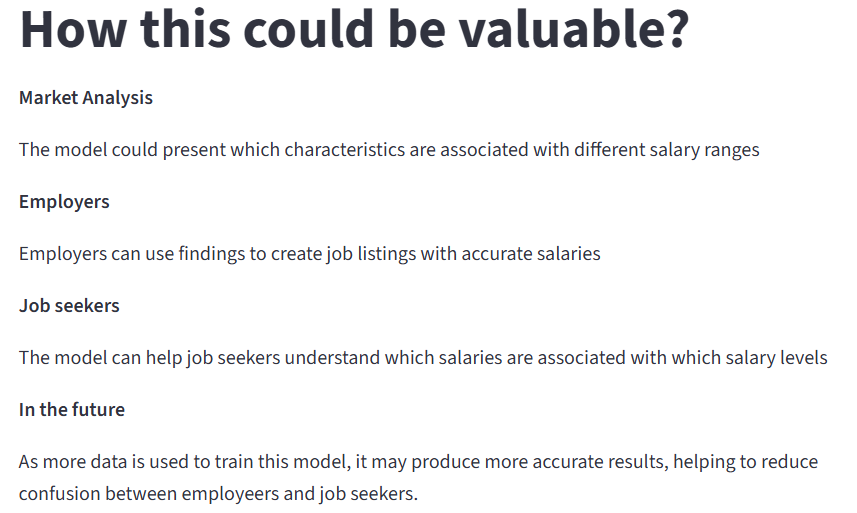
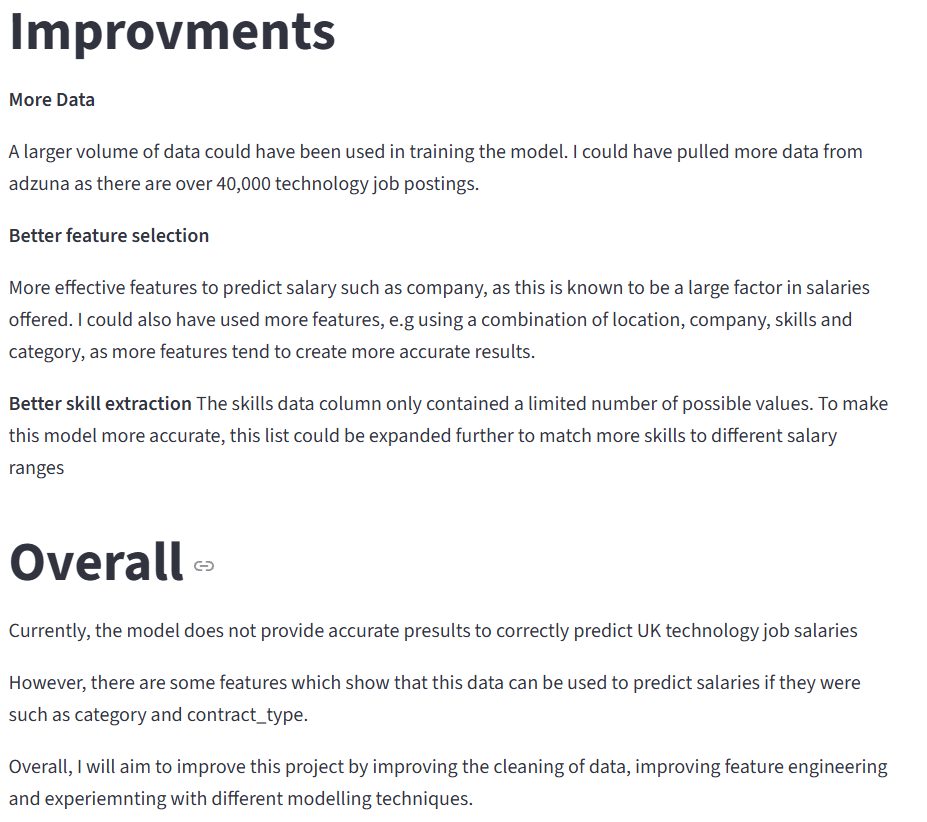

# Uk job Market analyser

# Overview

This is data engineering and machine learning project which analyses UK technology job market.
The project collects technology job postings from adzuna API, then cleans and transforms the data using pandas and numpy. Feature engineering is used to create new features from the existing data.
Cleaned data is saved to a PostgreSQL database, where it is queried from to gain insights on the job market.
Data from querieing the database is used to create charts and graphs with matplotlib to showcase trends and relationships in this data. 
App.py is a dash, dashboard app which showcases these graphs and insights together.

I then trained a random forest regression model, with the data to see if job characteristics could be used to predict salaries. Findings from this experiment are presented in a data - science like experiment / work.

# Key features

- Extracting 4972 job postings from Adzuna API
- Cleaning and transforming data using numpy and pandas
- Feature engineering is used to create new features from existing data, including skills, job category and location
- Cleaned data is stored in postgresql database
- Database is queried and analysed to find trends
- Trends are showcased on a dash, dashboard
- Random forest regression model is trained using data to experiment as to whether salaries can be predicted
- Findings from this are presented on a streamlit dashboard

# Technologies
- Python - used for data extraction, data cleaning and machine learning
- Pandas and numpy - used for working with data and feature engineering
- PostgreSQL - used to store data and query from
- SQL - Used to create tables, store data and query data
- scikt-learn - used random forest regression model to predict salaries
- Matplotlib - used to create graphs and charts, visualisations from data
- Dash - used to present findings, interactive dashboard
- Streamlit - used to present findings from experiment
- Github - used to manage project
- Adzuna API - Uk technology job postings source

# Data Workflow

1. Data is collected from Adzuna API saved as json
2. Convert data to csv and clean data to prepare for analysis
3. Use feature engineering to extract new columns
4. Store processed data into postgreSQL database
5. Query database to build visualisations and get insights
6. Visualisations and insights presented on dashboard
7. Use data to train random forest regression model and predict salaries
8. Present findings on streamlit dashboard 

## Project Structure

    ├── UK_job_market_analysis
    ├── pictures                            contains pictures shown in github repository
    ├── src                                 source code for use in this project.
    │   ├── data_analysis
    │   │      ├── queries.py               SQL methods for querying database
    │   │      └── visualisations.py        methods for creating visualisations
    │   ├── data_processing
    │   │      ├── download.py              Downloads data from Adzuna API
    │   │      ├── explore.py               Methods for exploring the dataset
    │   │      ├── clean.py                 Methods for cleaning the data
    │   │      ├── validation.py            Verifies that cleaning is completed correctly
    │   │      ├── database.py              Creates a connection to the postgreSQL databas
    │   │      └── main.py                  Runs entire data pipeline  
    │   ├── modelling
    │   │      ├── modelling.py             Trains and evaluates the Random Forest regression model
    │   │      └── presentation.py          Streamlit dashboard presenting findings from experiment

    ├── data                               Data methods (some files may not be present on github due to file size)
    │   ├── cleaned
    │   │      └── data.csv                 Cleaned data set used for SQL storage and training model
    │   ├── raw
    │   │    ├── data.json                  Raw data collected from the Adzuna API
    │   │    └── data.csv                   Raw data converted from JSON  
    │   └── create_table.sql                SQL used to create table 
    │   └── load_data.sql                   SQL used to copy data to postgreSQL database
    ├── app.py                              Builds the Dash dashboard using analysis methods ( visualsations and queries)
    └── requirements.txt                    requirements needed to run the project

# Data processing and feature engineering

Raw data was downloaded using Adzuna API, and saved as json file. 
This was converted into a csv file, which was then processed to create a dataset with useful features
These techniques are shown on clean.py

When processing the data I:
 - Filled unknown / null values with placeholders
 - dropped uncessesary columns which wont be needed in analysis
 - clean company column, converted string to dictionary and pulled company value 
 - convert location to only contain region, matching against list of UK regions 
 - convert salary is predicted to boolean values using mapping
 - round latitude nad longitude values to 2 dp
 - convert date column into two new year and month columns 
 - pull potential technical skills from descriptions and save in new column
 - create average salary using max and min salaries,
 - created new job category columns matching jobs against list of jobs

# SQL Analysis

After the data was cleaned, I saved it to postgreSQL database, where it was queried using SQL to find useful information
These techniques aer shown on queries.py

The questions I tried to answer were:
 - Getting metrics : number of jobs analysed, average salary, locations, companies
 - Getting the most needed job roles 
 - Getting average salary per role
 - Getting the top hiring companies
 - Getting the number of jobs per region using ILIKE to match values to regions
 - Getting the top skills needed, grouping matching skills together, then finding number of jobs it is found in

# Visualisations

These visualsations were created with findings from querieing the database using matplotlib or plotly
Source : visualisations.py 

They include:
 - Bar chart of top 10 hiring companies
 - Pie chart of vacancies per location
 - bar graph of most needed job roles with average salary 

# Dashboard

The dash, dashboard showcases findings from queriying with insights and visualisations

Dashboard workflow:
 
 - Import queriying methods and visualisation methods to build graphs in the dashboard
 - Split dashboard into three horizontal sections / layers
 - Layer 1
    - Metrics to show top findings
    - Average salary per role table
    - Most in demand roles with hover salaries, bar chart
- Layer 2
    - Top hiring companies horizontal bar chart
    - Top hiring regions
- Layer 3
    - Analyse skills, with average salaries, percentage of job market and number of vacancies 

# Machine learning model

I trained a random forest regression model with job data to find out whether salaries could be predicted.
The value I was trying to predict was average_ salary which I created with feature engineering wiht minimum and maximum salary.

The features I tested to train the model were combinations of :
 - job category
 - skills
 - location
 - contract type ( part time / full time)

I evaluated the model using root mean squared error and R2. 
I found that some data could be used to predict salaries such as job category and lcontract type. However, after evaluating the model
there needs to be more better data features to make this accurate. 
The model could be improved in the future with better features and a larger dataset to more accurately predict salaries.

These methods inspired by BCG Data science virtual work experience

# Data science dashboard

Results from the experiment are showcased on this dashboard.
I used the presentation layout from my virtual work experience : BCG data science 

This presentation includes:
 - Experimentation title and what i want to get
 - The recommended solution
 - Why the results could be useful
 - My findings
 - Critiques of the model 
 - Overall evaluation of experiment

# Key findings
- Software engineering is the most in demand job role with around 25% of the this dataset
- AI and ML also seems to be rising as more firms want AI skills
- Currently the hackajob ltd, Appen and Emplyfly seems to be hiring the most technology jobs, above Amazon and JP morgan
- London seems to be the city with the most available jobs, however there is still a large proportion of jobs outside the main cities
- Skills such as python, AWS, SQL and Java are largely wanted by firms
- Using the current data predicting salaries is not accurate, however there are signs showing it could be more accurate if better features were used to train the model

# Future improvemnts
 - Increase dataset to pull more job listings from Adzuna API
 - Use better feature engineering to create better parameters for machine learning model
 - Find more useful insights for employers and employees
